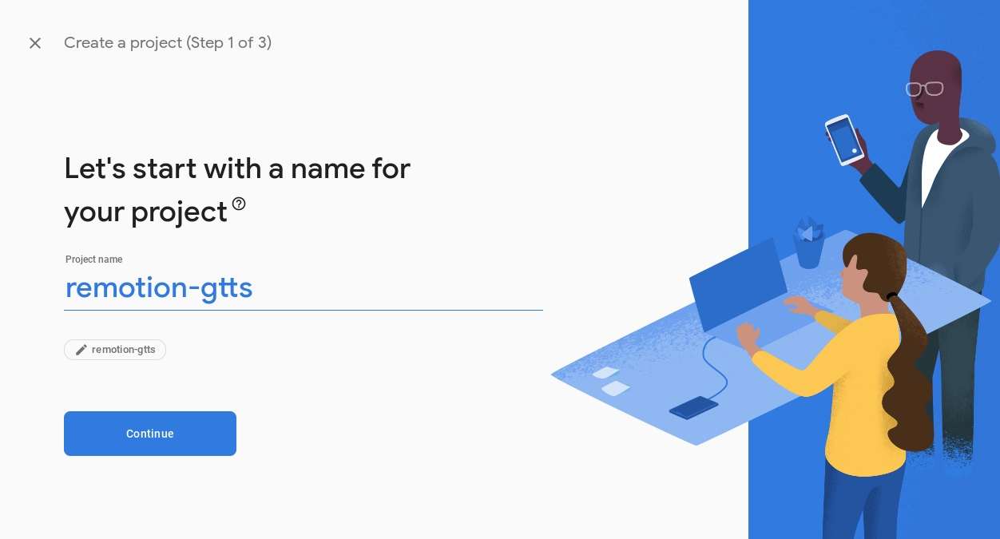
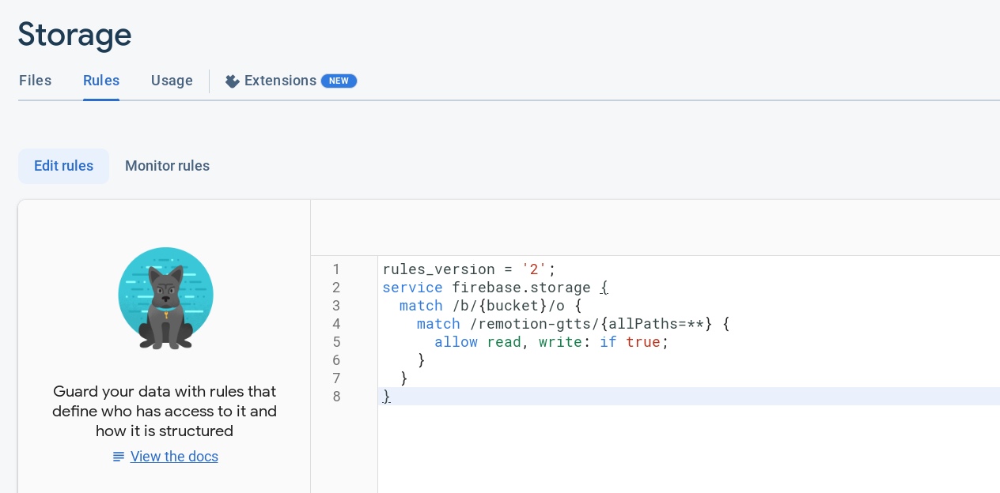

# Remotion Text-to-Speech Template

## Uses Google Cloud Platform + Firebase Storage

### **_NOTE:_** This is WIP, and **NOT** an official template yet, so do not use it in production.

### Feel free to try out and experiment with it. Report bugs and issues if you encounter.

<p align="center">
  <a href="https://github.com/remotion-dev/logo">
    <picture>
      <source media="(prefers-color-scheme: dark)" srcset="https://github.com/remotion-dev/logo/raw/main/animated-logo-banner-dark.gif">
      
    </picture>
  </a>
</p>

## PROBLEMS TO FIX:

1. Must kill the express server after render finishes.

- Maybe fixable using `pm2`?
- `npm run audioserver` should launch via `pm2` instead of `ts-node`.
- Then simply kill it via `pm2 stop <path of file>`

2. Doesn't work in codespaces because `audioserver` URL is `localhost:PORT`

## Get Started

1. Create a Firebase Project
   

2. Go to Project Settings. In the "General" tab, go to "Your apps" section and register a "Web App".

<!-- VIDEO -->

/assets/firebase-register.mp4

3. Copy the config credentials and paste into `.env`

4. Enable storage, create storage bucket, and edit rules to allow read, write for `remotion-gtts` directory (or any other directory that you have specified for `audioDirectoryInBucket` in the `constants.ts` file).

<!-- VIDEO -->

/assets/firebase-storage-enable.mp4

- Configure bucket rules

```js
  rules_version = '2';
  service firebase.storage {
    match /b/{bucket}/o {
      match /remotion-gtts/{allPaths=**} {
        allow read, write: if true;
      }
    }
  }
```

> Maybe you should have better security validation instead of just allowing `write` to everyone.



5. Enable TTS API on GCP

- You will probably already have a project set up in GCP with the same name as the Firebase project you created earlier. Just use that, to keep things simple.

- Open hambuger menu, go to APIs and Services -> Library
- Search for "text to speech", and enable **Cloud Text-to-Speech API**. You may be required to enable billing, by creating a billing account. (Be sure to also review the pricing tab)


<!-- VIDEO -->

/assets/gcp-enable-api.mp4

6. Create Credentials

- After API is enabled, click on **Manage** -> **Credentials** (on sidebar)


- Click on **CREATE CREDENTIALS** and select Service Account


- Fill relevant fields, select the _Basic_ role of **_Owner_**, and skip the other optional fields if not required.

<!-- VIDEO -->

/assets/gcp-create-serviceaccount.mp4

- Now create a JSON key to download credentials as a `.json` file.

<!-- VIDEO -->

/assets/gcp-create-key.mp4

- Name the JSON file as `serviceaccount.json` and place it in the root of your project - `/serviceaccount.json`

> **IMPORTANT:** This file must never be committed, and must be added to .gitignore, .dockerignore, etc. if you change its name to something different.

> If you change the location of this file, make sure to also update `GOOGLE_APPLICATION_CREDENTIALS` in `.env`

7. Copy `.env.example` to `.env` and enter your secrets.

## Example

Here's a sample video rendered using this template. _(Be sure to unmute the player)_

https://user-images.githubusercontent.com/38887390/232199560-d275def7-d147-4f29-acc6-5a81d267ba68.mp4

## Commands

**Install Dependencies**

```console
npm i
```

**Start Preview**

```console
npm start
```

**Render video**

```console
npm run build
```

See [docs for server-side rendering](https://www.remotion.dev/docs/ssr) here.

**Upgrade Remotion**

```console
npm run upgrade
```

## Docs

Get started with Remotion by reading the [fundamentals page](https://www.remotion.dev/docs/the-fundamentals).

## Issues

Found an issue with Remotion? [File an issue here](https://github.com/JonnyBurger/remotion/issues/new).

## License

Notice that for some entities a company license is needed. Read [the terms here](https://github.com/JonnyBurger/remotion/blob/main/LICENSE.md).
